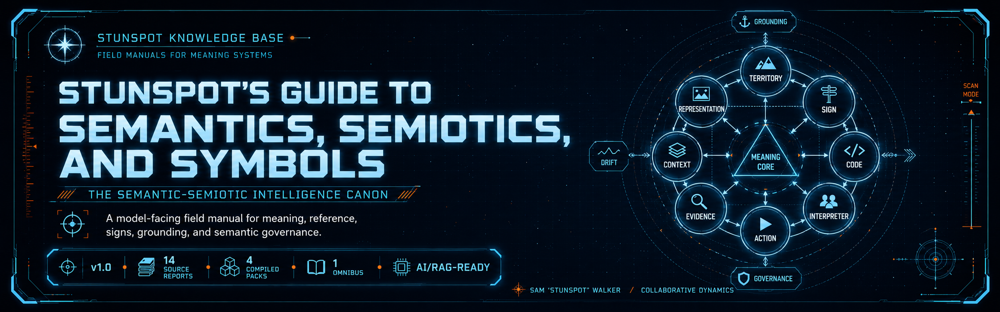

<p align="center">
  
</p>

# Stunspot's Guide to Semantics, Semiotics, and Symbols

**The Semantic-Semiotic Intelligence Canon**  
*A model-facing field manual for representation, reference, signs, meaning, symbols, interpretation, grounding, and semantic governance.*


[](https://doi.org/10.5281/zenodo.21039269)

*Stunspot's Guide to Semantics, Semiotics, and Symbols* is a Markdown-native knowledge canon by Sam “stunspot” Walker / Collaborative Dynamics.

Its main audience is the model.

The repository is human-readable, but it is built primarily as a structured substrate for AI workspaces, RAG systems, long-context sessions, project knowledge bases, and assistant governance layers. Loaded into a model-facing environment, the canon supplies a disciplined vocabulary for distinguishing words from things, signs from referents, claims from evidence, retrieval from grounding, interpretation from warrant, and symbolic charge from neutral description.

The canon organizes **Semantic-Semiotic Intelligence (SSI)** as an operational discipline: the assistant learns to treat meaning as a relation among territory, representation, sign-process, code, context, evidence, interpreter, and action. The practical premise is simple:

> A representation is never the territory. A claim is not warranted merely because it is fluent. A sign only becomes useful when its referent, code, scope, evidence, interpretive context, and permissible use are made explicit.

Use it as reference material.  
Use it as RAG substrate.  
Use it as project knowledge.  
Use it as doctrine for assistants that need to reason about language, symbols, meaning, source claims, interpretation, and semantic failure without collapsing everything into vibes. Very stylish vibes, yes, but still vibes.

---

## Start Here

- [Canon Map](./docs/canon-map.md) — the report sequence and conceptual spine.
- [How to Use This Canon](./docs/how-to-use-this-canon.md) — practical guidance for humans, AI Projects, RAG systems, and long-context workflows.
- [Knowledge Packs](./docs/knowledge-packs.md) — which upload format to use and why.
- [Status](./STATUS.md) — release maturity and corpus boundaries.
- [Manifest](./MANIFEST.md) — source-to-output mappings and repository file index.

---

## Corpus Shape

- **14 source reports** in [`knowledge-packs/by-report/`](./knowledge-packs/by-report/)
- **4 compiled packs** in [`knowledge-packs/compiled-packs/`](./knowledge-packs/compiled-packs/)
- **1 omnibus file** in [`knowledge-packs/omnibus/`](./knowledge-packs/omnibus/)

`docs/` is the navigation and guidance layer. It is not the individual report corpus. The source-report corpus lives in `knowledge-packs/by-report/`; compiled upload packs live in `knowledge-packs/compiled-packs/`; the whole-corpus bundle lives in `knowledge-packs/omnibus/`.

---

## Knowledge Packs

For most AI/RAG systems, start with the **compiled packs**. They preserve the four-volume structure while avoiding both extremes: fourteen separate files or one large omnibus file.

| Pack | Location | Best Use |
|---|---|---|
| **Source reports** | [`knowledge-packs/by-report/`](./knowledge-packs/by-report/) | Canonical individual units; best for precise retrieval, selective upload, citation, editing, and source-level inspection. |
| **Compiled packs** | [`knowledge-packs/compiled-packs/`](./knowledge-packs/compiled-packs/) | Recommended default for most model workspaces; four files grouped by conceptual volume. |
| **Omnibus** | [`knowledge-packs/omnibus/`](./knowledge-packs/omnibus/) | One-file import, archival reference, local search, or long-context/RAG systems that handle large single files well. |

---

## What This Canon Covers

The canon is organized across **4 volumes** and **14 reports**, from **A** through **N**.

It covers:

- representation, abstraction, map/territory discipline, non-identity, non-allness, indexing, and dating
- sign-relations, codes, semiosis, icons, indices, symbols, interpretants, and semiospheres
- linguistic structure, compositional meaning, concepts, categories, frames, and prototypes
- reference, grounding, evidence ecology, truth conditions, warrant, confidence, and permissible use
- context, intention, pragmatics, discourse, narrative, metaphor, embodiment, symbolic culture, myth, ritual, and memetics
- multimodal signs, interface symbolics, UI meaning, visual rhetoric, and cross-channel interpretation
- ambiguity, polysemy, semantic drift, translation, domain transfer, and cross-cultural variance
- semantic pathologies, manipulation, interpretive failure, symbolic charge, ideological framing, and assistant governance
- knowledge infrastructure, provenance, semantic routing, active metadata, reusable lenses, and RAG-ready artifacts

---

## Who This Is For

This canon is useful for people building or steering model-facing systems where meaning quality matters:

- **prompt engineers** designing high-resolution assistant behavior and interpretive protocols
- **RAG and knowledge-system builders** working with source provenance, retrieval quality, citation support, and context hygiene
- **AI product leads and system designers** building assistants that must reason across documents, symbols, policies, interfaces, and social contexts
- **analysts, researchers, and writers** who need a disciplined map of meaning, reference, evidence, and interpretation
- **governance and evaluation teams** concerned with hallucination, semantic drift, manipulation, source laundering, and symbolic bias
- **serious learners** who want the machinery of meaning, not another tray of lukewarm definition soup

---

## How To Read It

The canon can be read straight through, but most users should enter through the problem.

### If you are building RAG or project knowledge

Start with:

1. [A. Reality, Representation & Abstraction](./knowledge-packs/by-report/a-reality-representation-and-abstraction.md)
2. [E. Reference, Grounding & Epistemic Validity](./knowledge-packs/by-report/e-reference-grounding-and-epistemic-validity.md)
3. [K. Ambiguity, Polysemy & Semantic Drift](./knowledge-packs/by-report/k-ambiguity-polysemy-and-semantic-drift.md)
4. [N. Knowledge Infrastructure, Artifacts & Assistant Governance](./knowledge-packs/by-report/n-knowledge-infrastructure-artifacts-and-assistant-governance.md)

### If you are designing assistant behavior

Start with:

1. [B. Sign-Relations, Codes & Semiosis](./knowledge-packs/by-report/b-sign-relations-codes-and-semiosis.md)
2. [F. Context, Intention & Pragmatic Inference](./knowledge-packs/by-report/f-context-intention-and-pragmatic-inference.md)
3. [M. Semantic Pathologies, Manipulation & Interpretive Failure](./knowledge-packs/by-report/m-semantic-pathologies-manipulation-and-interpretive-failure.md)
4. [N. Knowledge Infrastructure, Artifacts & Assistant Governance](./knowledge-packs/by-report/n-knowledge-infrastructure-artifacts-and-assistant-governance.md)

### If you want the philosophical spine

Read the sequence in order: **A → B → C → D → E**, then jump to **K**, **M**, and **N**.

---

## Repository Structure

```text
.
├── README.md
├── LICENSE.md
├── CITATION.cff
├── CHANGELOG.md
├── STATUS.md
├── MANIFEST.md
├── manifest.json
├── docs/
│   ├── index.md
│   ├── canon-map.md
│   ├── how-to-use-this-canon.md
│   ├── knowledge-packs.md
│   ├── _config.yml
│   ├── _layouts/
│   │   └── default.html
│   └── assets/
│       ├── brand/
│       │   └── coldwire-bg.jpg
│       └── css/
│           └── style.css
└── knowledge-packs/
    ├── by-report/
    ├── compiled-packs/
    └── omnibus/
```

---

## Citation and License

Citation metadata is provided in [`CITATION.cff`](./CITATION.cff).

Unless otherwise stated, this repository is licensed under **Creative Commons Attribution-NonCommercial-ShareAlike 4.0 International** (**CC BY-NC-SA 4.0**). Commercial use requires prior written permission from Sam “stunspot” Walker / Collaborative Dynamics.

These materials are provided as-is for educational, research, design, and reference use. Verify high-impact claims before relying on them.

GitHub: https://github.com/Stunspot/stunspots-guide-to-semantics-semiotics-and-symbols  
Pages URL: https://stunspot.github.io/stunspots-guide-to-semantics-semiotics-and-symbols/
