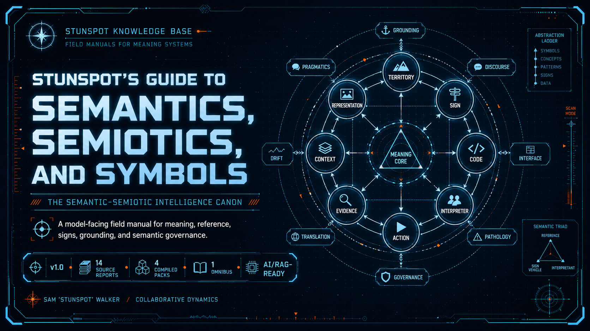

  

# Stunspot's Guide to Semantics, Semiotics, and Symbols

**A model-facing canon for semantics, semiotics, symbols, meaning, reference, and interpretation.**

- [Canon Map](./canon-map.md)
- [How to Use This Canon](./how-to-use-this-canon.md)
- [Knowledge Packs](./knowledge-packs.md)

This site is the navigation layer. The individual report corpus lives in `knowledge-packs/by-report/` in the repository.
